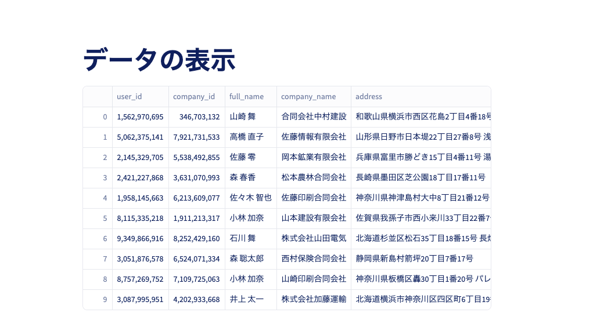
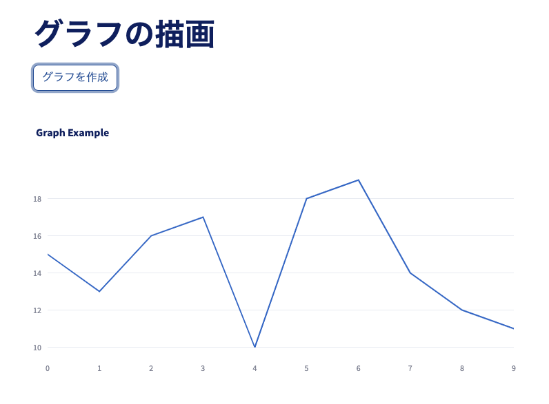
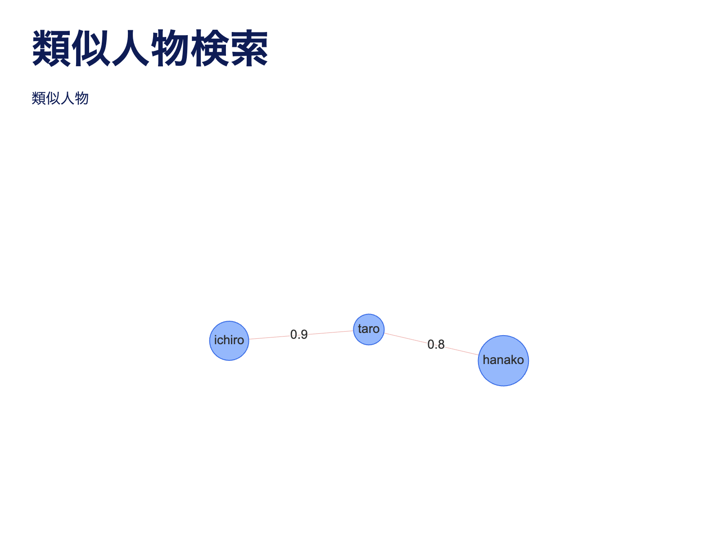

# （事前準備）1dayインターン環境構築

- [（事前準備）1dayインターン環境構築](#事前準備1dayインターン環境構築)
- [Python 関連の環境構築](#python-関連の環境構築)
  - [uv のインストール](#uv-のインストール)
  - [試しに使ってみて実行確認](#試しに使ってみて実行確認)
- [VScode](#vscode)
- [動かしてみる](#動かしてみる)
  - [仮想環境の作成](#仮想環境の作成)
  - [Streamlitの実装](#streamlitの実装)
  - [便利なStreamlitツールの紹介](#便利なstreamlitツールの紹介)
    - [Plotly](#plotly)
    - [streamlit\_agraph](#streamlit_agraph)


# Python 関連の環境構築
作業環境にgit がインストールされていない場合はインストールしておくこと。
バージョンは違っていても構いません。
```bash
$ git --version
git version 2.49.0
```

## uv のインストール

Linux, MacOS, WSL 向けのインストール方法
下記のコマンドを実行してください。
```bash
curl -LsSf https://astral.sh/uv/install.sh | sh
```

<details><summary>Windows (PowerShell) 向けインストール手順</summary>

irm を使ってインストールします。下記のコマンドを実行してください。
```powershell
powershell -ExecutionPolicy ByPass -c "irm https://astral.sh/uv/install.ps1 | iex"
```
</details>

その他のインストール方法を使いたい場合は[ドキュメント](https://docs.astral.sh/uv/getting-started/installation/)を参照してください。

## 試しに使ってみて実行確認

```bash
uv init --project sample
cd sample && uv run main.py
```

<details><summary>Windows (PowerShell) 向け</summary>

```powershell
uv init --project sample
cd sample; uv run main.py
```
</details>

以下のように Python が実行されていれば OK です。
```bash
Initialized project `sample`
Hello from sample!
```

パッケージを追加したい場合は `uv add` を実行してください。
```bash
uv add plotly
```
実行することで、`pyproject.toml` 及び `uv.lock` が更新されてパッケージに関しての情報が保存されます。

# VScode

今回はエディターとして、VSCodeを利用することを推奨します。拡張機能として以下をインストールしてください。

- [Python](https://marketplace.visualstudio.com/items?itemName=ms-python.python)
- [ruff](https://marketplace.visualstudio.com/items?itemName=charliermarsh.ruff)
- [mypy](https://marketplace.visualstudio.com/items?itemName=ms-python.mypy-type-checker)

好きな場所で、1Dayインターン用のワークスペースを作成してください。

ワークスペースの直下で、VScodeの設定ファイル`.vscode/settings.json`を作成します。

```python
$ touch .vscode/settings.json  # Bash

> New-Item .vscode/settings.json  # Powershell
```

ファイルの中身を以下のようにします。

```powershell
{
    "files.trimTrailingWhitespace": true,
    "files.insertFinalNewline": true,
    "python.analysis.autoImportCompletions": false,
    "python.analysis.diagnosticMode": "workspace",
    "python.analysis.typeCheckingMode": "off",
    // mypy
    "mypy-type-checker.importStrategy": "fromEnvironment",
    // test
    "python.testing.pytestEnabled": true,
    // ruff
    "ruff.lint.enable": true,
    "ruff.importStrategy": "fromEnvironment",
    // ruff formatter
    "[python]": {
        "editor.formatOnSave": true,
        "editor.codeActionsOnSave": {
            "source.fixAll": "explicit",
            "source.organizeImports": "explicit"
        },
        "editor.defaultFormatter": "charliermarsh.ruff",
    }
}
```

# 動かしてみる

## 仮想環境の作成

引き続き、先ほど作成したワークスペース内で作業します。

仮想環境を作成するために、pyproject.tomlを作成します。

```bash
$ touch pyproject.toml  # Bash

> New-Item pyproject.toml  # Powershell
```

中身には以下をコピーしてください。

```toml
[project]
name = "app"
version = "0.1.0"
description = "1day intern app"
requires-python = ">=3.10,<3.14"
dependencies = [
    "streamlit>=1.43.2",
    "streamlit-agraph>=0.0.45",
    "requests>=2.32.3",
]

[dependency-groups]
dev = [
    "ruff>=0.11.2",
    "mypy>=1.15.0",
    "pytest>=8.3.5",
    "types-requests>=2.32.0.20250306",
]

[tool.mypy]
check_untyped_defs = true
ignore_errors = false
strict_optional = true
warn_unused_configs = true
warn_unused_ignores = true
warn_redundant_casts = true
ignore_missing_imports = true

[tool.ruff]
target-version = "py313"
line-length = 120
lint.select = ["ALL"]
lint.ignore = [
    "COM812",   # missing-trailing-comma
    "E741",     # ambiguous-variable-name
    "ISC001",   # single-line-implicit-string-concatenation
    "S101",     # assert
    "S311",     # suspicious-non-cryptographic-random-usage
    "RET504",   # unnecessary-assign
    "PLR2004",  # magic-value-comparison
    "D",        # pydocstyle
    "ANN",      # flake8-annotations
]
exclude = [
    ".git",
    ".github",
    ".mypy_cache",
    ".pytest_cache",
    ".ruff_cache",
    ".venv",
    "__pycache__",
]

[tool.ruff.lint.per-file-ignores]
"tests/**/*" = [
    "S101",     # assert
    "PLR2004",  # magic-value-comparison
    "INP001",   # input
    "D"         # pydocstyle
]

[tool.ruff.lint.mccabe]
max-complexity = 5
```

`project.dependencies`, `dependency-groups.dev` にインストールしたいpythonライブラリとそのバージョンを記述します。

`dependency-groups.dev` には、テスト関連のライブラリなど、開発環境にのみインストールしたいライブラリを記述します。
オプションなしの `uv sync` コマンドですべてのライブラリをインストールします。
`.venv` フォルダに仮想環境が作成されます。
仮想環境内でコマンドを実行したい場合は、`uv run` を先頭に書くことで実行できます。

```bash
$ uv sync

$ uv run python
```

`tool.mypy`や`tool.ruff`はリンター、フォーマッターに関する設定を記述しています。

ライブラリを追加したい場合は

```python
$ uv add <ライブラリ名>

# 開発用パッケージの場合は
$ uv add --dev <ライブラリ名>
```

を実行することで、ライブラリ間の依存関係を考慮しつつ、自動でインストールされます。
ライブラリ名は[PyPI](https://pypi.org/)に載っているものと一致させる必要があります。
その他、詳しく知りたい方は[公式ドキュメント](https://docs.astral.sh/uv/#projects)を参照してください。

## Streamlitの実装

StreamlitはPythonでさくっとUIを作ることができるライブラリです。
R&Dでは実際に [Sansan Labs](https://sin.sansan.com/best_practice/sansan-labs-2/) という実験的な機能を提供するサービスで使われています。
その他にも Google X や Yelp、Uber などでも使われているようです（[参考](https://streamlit.io/)）。

Streamlitを実行するために、設定ファイル`config.toml`を作成します。

```bash
$ touch .streamlit/config.toml  # Bash

> New-Item .streamlit/config.toml  # Powershell
```

中身の設定値は以下のように設定してください。

```bash
[global]
developmentMode = false

[server]
port = 8080
runOnSave = false
headless = true

[browser]
gatherUsageStats = false
serverAddress = "localhost"

[client]
showErrorDetails = false
toolbarMode = "minimal"

[ui]
hideTopBar = true

[theme]
base="light"
primaryColor="#004E98"
backgroundColor="#FFFFFF"
secondaryBackgroundColor="#F8F9FA"
textColor="#002060"
```

今回は設定について詳しく説明しませんが、気になる方は[公式ドキュメント](https://docs.streamlit.io/develop/api-reference/configuration/config.toml)を参照してください。

それでは、Streamlitでページを作成しましょう。サンプルとして、表データを描画するスクリプトを作ってみます。

pythonファイルを作成します。

```bash
$ touch display_table.py  # Bash

> New-Item display_table.py  # Powershell
```

中身は以下の通りです。

```python
from io import StringIO

import pandas as pd
import streamlit as st

# タイトル
st.title("表の描画")

# ダミーデータ。本番ではAPIから取得する。
data = """
user_id,company_id,full_name,company_name,address,phone_number
1562970695,346703132,山崎 舞,合同会社中村建設,和歌山県横浜市西区花島2丁目4番18号 箪笥町コート059,090-4299-5127
5062375141,7921731533,高橋 直子,佐藤情報有限会社,山形県日野市日本堤22丁目27番8号 浅草橋アーバン760,08-6736-3477
2145329705,5538492855,佐藤 零,岡本鉱業有限会社,兵庫県富里市勝どき15丁目4番11号 湯宮アーバン985,59-7844-0992
2421227868,3631070993,森 春香,松本農林合同会社,長崎県墨田区芝公園18丁目17番11号,36-3927-4883
1958145663,6213609077,佐々木 智也,佐藤印刷合同会社,神奈川県神津島村大中8丁目21番12号,080-9829-8733
8115335218,1911213317,小林 加奈,山本建設有限会社,佐賀県我孫子市西小来川33丁目22番7号,090-1939-2614
9349866916,8252429160,石川 舞,株式会社山田電気,北海道杉並区松石35丁目18番15号 長畑ハイツ620,080-9821-5323
3051876578,6524071334,森 聡太郎,西村保険合同会社,静岡県新島村箭坪20丁目7番17号,070-3139-2253
8757269752,7109725063,小林 加奈,山崎印刷合同会社,神奈川県板橋区轟30丁目1番20号 パレス蟇沼142,090-1886-0925
3087995951,4202933668,井上 太一,株式会社加藤運輸,北海道横浜市神奈川区四区町6丁目19番11号 氏家コーポ195,08-9498-6285
"""

dummy_data = pd.read_csv(StringIO(data))

st.dataframe(dummy_data)
```

ここで、実際に描画処理を記述している部分は、タイトル表示`st.title("表の描画")`と表の描画`st.dataframe(df)` の2行のみです。このように、streamlitでは直感的に素早くUIを作成することができます。

それでは、手元で実行してみましょう。

```bash
$ uv run streamlit run display_table.py
```

`http://localhost:8080`に接続し、以下のような画面が出ると成功です。



## 便利なStreamlitツールの紹介

### Plotly

グラフや図を簡潔に描画できるライブラリ（[参考](https://plotly.com/python/)）。

以下のサンプルコードを実行し、UI上のボタンを押すと、折れ線グラフが描画されます。
(実行には、`plotly` のインストールが必要なので、`uv add` コマンドを実行してインストールした上で実行してみましょう！)

```python
import random

import plotly.graph_objects as go
import streamlit as st

# タイトル
st.title("グラフの描画")


def display_plot(xx: list[int], yy: list[int]) -> None:
    fig = go.Figure()

    # データを追加する
    fig.add_trace(go.Scatter(x=xx, y=yy, mode="lines", name="New Trace"))

    # レイアウトを更新する
    fig.update_layout(title_text="Graph Example")

    st.plotly_chart(fig)


# 新しい作成し、描画するボタン
if st.button("グラフを作成"):
    # 新しいデータを作成する
    points_num = 10
    xx = list(range(points_num))
    yy = random.sample(range(10, 20), points_num)

    display_plot(xx, yy)
```

`if st.button()` 以下に、ボタンが押されたときの処理を書きます。

`graph_objectsのFigure()`でfigureが初期化されます。`fig.add_trace()`で描画したいグラフの情報を入力します。ここで複数のグラフを追加することもできます。`fig.update_layout`で図全体のレイアウトを設定（上書き）することができます。最後に、`st.plotly_chart(fig)`で仮面上にグラフが描画されます。



### streamlit_agraph

グラフ（ネットワーク）を描画できるライブラリ（[参考](https://github.com/ChrisDelClea/streamlit-agraph)）。

以下のサンプルコードを実行してみると、画面上にネットワークが表示されます。
(このコードの実行には `plotly` は不要なので、`uv remove plotly` を実行してライブラリをアンインストールしてみましょう!)

```python
import streamlit as st
from streamlit_agraph import Config, Edge, Node, agraph

# タイトル
st.title("類似人物検索")

st.write(f"類似人物")

# 描画するNodeの登録
nodes = [
    Node(id="taro", label="taro", shape="circle"),
    Node(id="ichiro", label="ichiro", shape="circle"),
    Node(id="hanako", label="hanako", shape="circle"),
]

# 描画するEdgeの登録
edges = [
    Edge(source="taro", target="ichiro", label="0.9"),
    Edge(source="taro", target="hanako", label="0.8"),
]

# グラフの描画設定
config = Config(
    height=500,
    directed=False,
    physics=True,
)

# 描画
agraph(nodes, edges, config)
```

このように、ノードリスト(nodes)、エッジリスト(edges)、描画設定(config)を定義すれば簡単にネットワークを描画できます（[参考](https://github.com/ChrisDelClea/streamlit-agraph)）。


